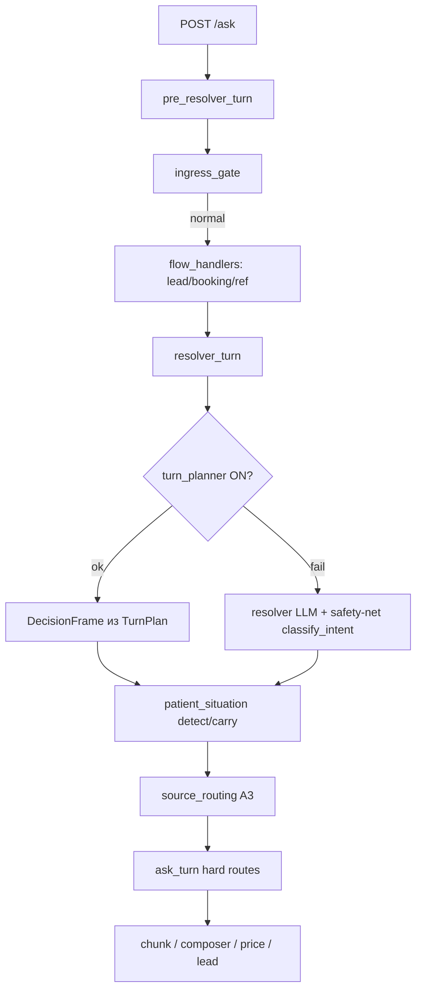

# ARCH_RECON — слой понимания/роутинга (demo)

**Задача:** `TASK.md` — архитектурная разведка перед переходом «Понять → Политика → Ответить»  
**Статус:** разведка завершена, код **не** писался  
**Дата:** 2026-07-11  
**Следующий шаг:** СТОП → проектное решение Клода (целевая форма + порядок strangler-переноса)

---

## 0. Контекст и метод

- Инвентаризация по коду: pre-resolver → resolver/planner → A3 → ask_turn → composer/chunk.
- Live-прогон «боюсь про Х» (5 формулировок) через `E2E_USE_TEST_CLIENT=1` + Flask `test_client` — **полный** `/ask/stream`, реальные LLM, канонические флаги (`FULLCTX_ON`, `COMPOSER_ON`, `TURN_PLANNER_ON` и др.).
- Недоделанная trust-линия (Фаза 2 TASK) **не коммитилась**; в отчёте учтена как симптом системной дыры, не как точечный баг.

---

## 1. Полная карта слоя понимания/роутинга

### 1.1. Сквозная схема потока



**Фактический порядок post-resolver в `orchestration/ask_turn.py`:** contacts → patient playbook (content/price overview) → A3 doctor → A3 trust → brand early → composer overlay → catalog facts → price flow → composer fallback.

### 1.2. Таблица решателей

| # | Место | Вход | Что решает | Технология | Выдаёт | Потребитель |
|---|--------|------|------------|------------|--------|-------------|
| 1 | `orchestration/route_guards.py`, `pre_resolver_turn.py` | q, session | rate limit, duplicate, burst, obvious noise, short continuation | regex + session | service_reply / clarify | сразу ответ |
| 2 | `ingress_gate.py` | q, client_id | hard_stop, manual_contact, clinic policy, service_not_offered, **normal**; страх приживления → normal (det) | regex + **LLM** (lite/full) + catalog ground truth | `IngressRouteResult` | pre_resolver → ранний ответ или пропуск |
| 3 | `flow_handlers.py` | q, ref, session | lead flow, booking, ref-click, promo, price widget ref | regex + **LLM** (booking, lead gray) + session | flow payload | lead_flow / chunk |
| 4 | `policy.contacts_intent`, `query_selector.price_rules_hint` | q | contacts; **price_lookup / price_concern до Resolver** | regex (`PRICE_*`, `CONTACTS_RE`) | intent hint / bool | resolver_turn, source_routing |
| 5 | `core/turn_planner_llm.py` | q, catalog, history, pending clarify | route, aspects, service_id, followup, needs_clarify, patient_situation, brand_filter | **1× LLM** + det. guards (protocol, focus) | `TurnPlan` → `DecisionFrame` | resolver_turn (если `TURN_PLANNER_ON`) |
| 6 | `resolver.py` | q, history | route_intent, service_topic, service_id, query_mode, confidence | **LLM** JSON | `DecisionFrame` | resolver_turn (fail-open / planner off) |
| 7 | `llm.classify_intent` | q | legacy intent (5 labels) | **LLM** | string intent | safety-net при низкой confidence; `RESOLVER_OFF=1` |
| 8 | `llm.classify_price_intent` | q | price_lookup / price_concern / other | **LLM** (если `PRICE_INTENT_LLM_ON`) | label | price routing fallback |
| 9 | `core/patient_situation.py` + `patient_situation_llm` | q, session | kind, scope, cues (клиническая ситуация) | regex + **LLM** | `PatientSituationResult` | playbook overview, price scope, telemetry |
| 10 | `core/dialog_focus.py` + `llm.classify_dialog_focus_gray_zone` | q, session | смена/сохранение фокуса (service, attribute) | rules + **LLM** gray | `DialogFocusDecision` | price route, doctor followup, session context |
| 11 | `llm` aspect_planner (`ASPECT_PLANNER_LLM_ON`) | q | aspects (price, pain, warranty…) | regex fallback + **LLM** | aspect list | composer packet (параллельно/legacy) |
| 12 | `source_routing.py` (A3) | q, DecisionFrame, app_intent | source: doctor, **trust**, catalog_facts/md, price_*, none | **det.** probes + catalog match | `SourceRouteResult` | ask_turn, answer_plan/packet |
| 13 | `doctors_lookup.py` | q | staffing vs named doctor | regex probes | doctor hit | A3 priority gate |
| 14 | `trust_lookup.py` (недоделанная ветка) | q | social proof / fear osseo | regex probes | trust hit | A3 (если ri ≠ price_*) |
| 15 | `query_selector.select_price_service_route` | q, intent | price card / ref / clarify / unavailable | regex scope + catalog + pricebook | price route dict | A3 price_* |
| 16 | `orchestration/ask_turn.py` | intent, sr, situation | contacts, playbook, doctor, trust, brand, composer, price | ordered **policy tree** | `AskOrchestrationResult` | finalize / SSE |
| 17 | `orchestration/composer_flow.py` | q, plan, packet | full-context answer, empathy | **LLM** composer | composed text | widget |
| 18 | `core/routing.yaml` | — | пороги confidence, numeric gate, patient_situation | YAML constants | thresholds | все слои выше |

**Важно:** «понимание» сейчас **не одно место**, а 6–10 LLM-вызовов и 5+ regex-слоёв, часть из которых дублирует друг друга и может спорить на одном ходе.

---

## 2. `turn_planner` как кандидат в позвоночник

### 2.1. Что выдаёт (схема)

Контракт `contracts/turn_plan.py` / промпт `core/turn_planner_llm.py`:

| Поле | Тип | Смысл |
|------|-----|--------|
| `route` | content \| price_lookup \| price_concern \| unknown | коммерческий/контентный маршрут (как `DecisionFrame.route_intent`) |
| `aspects` | price, payment, warranty, pain, duration, comparison, stages, overview | **аспект вопроса** (частично пересекается с aspect_planner) |
| `service_id` | catalog id \| null | услуга хода |
| `followup_of` | catalog id \| null | продолжение предыдущего фокуса |
| `needs_clarify` | bool | переспрос по услугам (F1/F2) |
| `patient_situation` | `PatientSituationKind` \| null | **клиническая** ситуация (нет зуба, all-on-4 и т.д.) |
| `brand_filter` | {brand_group, brand} \| null | явный бренд пациента |

Материализация: `turn_plan_to_decision_frame()` → совместимый `DecisionFrame` (topic из service_id, query_mode из aspects).

### 2.2. Один ли это структурный вызов?

**Почти.** При `TURN_PLANNER_ON=1` (дефолт ON) `orchestration/resolver_turn.py` вызывает **один** flash LLM (`plan_turn`). Но на том же ходе параллельно/последовательно живут:

- ingress LLM (если не skipped),
- patient_situation LLM,
- dialog_focus LLM (на части ходов),
- aspect_planner LLM (если `ASPECT_PLANNER_LLM_ON`),
- resolver LLM при fail-open planner,
- booking/price intent LLM позже в price/composer path.

То есть planner — **центр intent/route**, но не центр **всего понимания**.

### 2.3. Насколько запутан и что мешает «единой точке»

| Проблема | Проявление |
|----------|------------|
| **Fail-open на resolver** | Любая validation error planner → resolver → другой `route_intent` (live: T8) |
| **Нет оси «эмоция»** | Модель пихает `patient_situation='fear'` → pydantic reject → fail-open |
| **Смешение осей** | `aspects: [pain]` vs `patient_situation` vs `route` — три поля про разное, без явной семантики |
| **Det. overlays поверх LLM** | protocol guard, focus enrichment — правильно для политики, но planner не «единственный источник правды» |
| **Price regex сильнее planner** | `price_rules_hint()` в A3 может переопределить frame до trust/doctor |
| **Дублирование с aspect_planner** | В логах fear_osseo: `aspect_planner_source: regex`, aspects `[pain]` — второй планировщик |
| **patient_situation enum** | Только клинические kind; эмоциональная обёртка не expressible → validation crash |

**Вывод:** turn_planner — **лучший существующий кандидат** в позвоночник «понять», но его нужно **расширить схемой осей** (отделить emotion от patient_situation) и **жёстко определить fail policy** (не silent fallback на resolver с другой семантикой).

---

## 3. Классификация слоёв

### (a) Сворачиваемое в единый «понять»

| Компонент | Почему дублирует |
|-----------|------------------|
| `resolver.py` LLM | Дублирует route/topic/mode turn_planner; нужен только как shadow/fallback на переходный период |
| `llm.classify_intent` | Legacy 5-way; safety-net при низкой confidence resolver |
| `llm` aspect_planner | Aspects уже в TurnPlan; в логах coexist с planner |
| `llm.classify_price_intent` | Price intent частично в planner.route + regex |
| `trust_intent_probe` / `doctors_intent_probe` | Отдельные regex-классификаторы **после** понимания — кандидаты в **policy**, не в «понять» |
| `ingress` эмоциональные подсказки | Частично дублирует то, что должно быть emotion axis |
| `patient_situation` LLM (отдельный вызов) | Может стать полем planner **или** вторым шагом того же JSON, но не третьим параллельным LLM |
| `dialog_focus` LLM | Followup/service focus — ось «контекст/продолжение» в единой схеме |

### (b) Несущая политика (остаётся детерминированной)

| Компонент | Зачем сохранить |
|-----------|-----------------|
| `query_selector` price regex (`PRICE_LOOKUP_RE`, `PRICE_CONCERN_RE`) | Доказанный dental price-scope; planner **не** заменяет (отменённый эксперимент 5.5a-2) |
| `numeric_fact_gate` | Вырезание выдуманных чисел |
| medzone-personal exclusions (`trust_medzone_personal`, ingress manual_contact guards) | Граница hand-off vs reassurance |
| `booking_date_defer`, `explicit_booking_intent` | Booking-flow инвариант |
| contacts regex / chunk | Жёсткий contacts path |
| ingress hard_stop / clinic policies | Нецелевое, pediatric, OMS |
| price_card / pricebook deterministic | Inline money только из pricebook |
| protocol choice guard, focus age guards | Детерминированные product guards поверх LLM |
| `core/routing.yaml` thresholds | Единый конфиг порогов |

### (c) Пересечения / конфликты / дубли

| Конфликт | Как проявляется |
|----------|-----------------|
| **Planner fail-open → resolver** | osseo-fear: planner `patient_situation='fear'` → crash → resolver `price_concern` |
| **A3 trust guard vs price_concern** | `source_routing.py:184-187` — trust не вызывается при `ri ∈ {price_lookup, price_concern}` |
| **Ingress vs resolver** | Ingress: страх приживления = normal; resolver после fail-open: price_concern |
| **Regex price vs planner route** | `price_rules_hint` может форсить price до A3 |
| **Trust probe vs composer** | Probe матчит только узкий fear-osseo regex; «боюсь больно/неопытные» — inconsistent |
| **Unit vs live routing** | `test_trust_route` подаёт `route_intent=content` вручную → зелёный T8; live — price_concern |
| **Emotion vs patient_situation** | Модель смешивает страх и клиническую ситуацию в одном поле enum |
| **Composer empathy vs dedicated route** | Composer «успокаивает» из случайного md (cost, pain, whitening) — нет политики reassurance |

---

## 4. Дыра эмоции — live-прогон «боюсь про Х»

**Условия:** `E2E_USE_TEST_CLIENT=1`, дефолтные ON-флаги + явный `TURN_PLANNER_ON=1`, client `demo`, свежий sid на каждый вопрос.

| ID | Вопрос | Итоговый route | answer_path | source (факт) | Planner | Комментарий |
|----|--------|----------------|-------------|---------------|---------|-------------|
| fear_pain | Боюсь, что имплантация будет **больно** | **trust_chunk** | single_source | trust A3 (regex `_FEAR_OSSEO` matcheт «имплант» в «имплантация») | ✅ route=content, aspects=[pain] | Случайно попал в trust side-gate; ответ с 99,8%, стажем — ок по тону |
| fear_whitening | Страшно делать **отбеливание**, вдруг больно | content (composer) | composer | none → composer | ✅ aspects=[pain], service=professional_whitening | Trust probe **не** matcheт; composer из whitening md |
| fear_duration | Боюсь, что лечение **займёт много времени** | content (composer) | composer | none | ✅ aspects=[duration] | Эмоция + duration aspect; нет reassurance policy |
| fear_doctors | Боюсь, что **врачи неопытные** | content (composer) | composer | none | ✅ aspects=[pain]? / content | Trust probe не ловит «неопытные»; composer взял `implantation__faq__pain.md` |
| fear_osseo | Боюсь, что имплант **не приживётся** (T8) | **price_concern** | composer | price_concern → cost.md | ❌ **fail-open**: planner validation `patient_situation='fear'` → resolver `price_concern` → trust **заблокирован** | Ответ фактически неплох (99,8%), но **маршрут неверный**: cost FAQ + CTA «уточнить стоимость» |

### Цепочка провала T8 (из логов live)

```
ingress: normal (content_prior_experience, skipped)
→ turn_planner LLM: patient_situation="fear" → Pydantic reject
→ turn_planner_fail_open_to_resolver
→ resolver: route_intent=price_concern, topic=implantation
→ source_routing: trust_intent_probe=True, BUT ri=price_concern → trust SKIP
→ source=price_concern, ref=implantation__faq__cost.md
→ composer (empathy_used=true)
```

### Где эмоция «не живёт» в модели данных

- `PatientSituationKind` — только клинико-объёмные kind; **нет** `fear` / `reassurance_needed`.
- `TurnPlan.aspects` содержит `pain`, но **pain ≠ emotion wrapper** («боюсь» ≠ «больно ли»).
- Ingress знает про страх приживления (det regex → normal), но **не передаёт** emotion downstream.
- Composer умеет `empathy_used=true`, но **без политики** — эмпатия + случайный chunk.

---

## 5. Eval-сеть — честная оценка

### 5.1. Живой роутинг или стабы?

| Уровень | Механизм | Живой? | Ограничение |
|---------|----------|--------|-------------|
| **E2E smoke/risk/trust** (`evals/v5/smoke_case_runner.py`) | `E2E_USE_TEST_CLIENT=1` → Flask `test_client` → полный `/ask` | **Да** — real LLM, real orchestration | Медленно, flaky от LLM; meta в UI не всегда полная |
| **HTTP eval** (без test client) | POST localhost:5000 | **Да** | Нужен поднятый сервер |
| **Unit `route_source` / `trust_intent_probe`** | Прямой вызов A3 с **ручным** `DecisionFrame` | **Нет** — stub на слое понимания | **Ложный зелёный T8**: frame `content`, live `price_concern` |
| **`infer_route_from_response`** | Эвристика по meta (`service_route`, `orch_route`, intent…) | Post-hoc label | Не source of truth; может расходиться с telemetry |
| **Golden source_routing** (`tests/test_source_routing_golden.py`) | Только A3 + frame | Stub resolver | Не ловит planner fail-open |

### 5.2. Проблема ложного зелёного (trust T8)

- Unit: `test_t8_fear_reassure_routes_trust` — зелёный.
- Live eval: T8 FAIL (`price_concern` + composer parity).
- **Разрыв:** тест не прогоняет `resolver_turn` / `plan_turn` / fail-open.

### 5.3. Что усилить для безопасного strangler-переноса

1. **Live routing matrix** — семейство кейсов «emotion/fear» через test_client, не через `route_source` stub.
2. **Assert на decision provenance** — `turn_planner_used`, `route_intent`, `source_route_decision.source` в meta/telemetry.
3. **Forbidden routes** (уже добавлено в smoke_case_runner) — расширить на emotion family.
4. **Regression gate:** smoke + risk + emotion matrix на каждый перенос сценария на позвоночник.
5. **Разделить unit:** probe tests (regex) vs **integration** «q → final route» (1 test per scenario family).
6. **Golden planner schema** — snapshot valid TurnPlan JSON для fear-фраз (без падения validation).

---

## 6. Предложение (для решения Клода)

> Не рерайт с нуля — **strangler**: один сценарий → общий позвоночник → удаление старого гейта.

### 6.1. Черновая единая схема «понять»

Расширить TurnPlan (или successor `TurnUnderstanding`) **явными осями**:

| Ось | Примеры значений | Назначение |
|-----|------------------|------------|
| **topic** | implantation, prosthetics, clinic, doctors, whitening… | тема (из catalog/topic map) |
| **intent** | info, price_lookup, price_concern, booking, contacts | коммерческий/сервисный intent |
| **aspect** | pain, duration, warranty, stages, comparison, overview | конкретный аспект услуги |
| **emotion** | none, fear, doubt, reassurance_seek | **новая ось** — обёртка без диагноза |
| **specificity** | overview, specific, comparison, process | бывший query_mode |
| **patient_scope** | one_tooth, full_arch, …, unknown | только клинико-объёмное (бывший patient_situation) |
| **service_id / followup_of** | catalog ids | как сейчас |
| **needs_clarify / brand_filter** | как сейчас | policy inputs |

**Правило политики (не LLM):**

- `emotion ∈ {fear, doubt}` + **нет** medzone-personal → **reassurance policy** (trust-bundle / osseo facts / pain FAQ — по topic).
- medzone-personal → hand-off (как сейчас).
- price regex wins on explicit money; emotion **не** downgrade в price_concern без price signal.

### 6.2. Пилот первым сценарием

**Кандидат: emotion / «боюсь»** (5 live-кейсов выше + T8).

Почему:

- Продуктово значимо (конверсия, guardrails §0 — страх не глушить).
- Уже есть trust-bundle контент и ingress det hints.
- Live дыра воспроизводима и измерима.
- Не требует трогать price-card / booking invariants в первом slice.

**Definition of done пилота:**

- Все 5 fear-фраз + T8 → `reassurance` route (не price_concern, не random composer).
- medzone-personal (T7) → по-прежнему medzone.
- Live eval matrix green; unit stub не единственный guard.

### 6.3. Черновой порядок переноса (strangler)

| Фаза | Действие | Удалить/ослабить после |
|------|----------|------------------------|
| **P0** | Расширить schema planner: `emotion` + валидация (nullable enum, не crash) | — |
| **P1** | Det. **policy layer**: `emotion → reassurance_route(topic)` (md bundle whitelist) | `trust_intent_probe` как routing gate |
| **P2** | Live eval matrix emotion (5+ кейсов) в smoke/trust group | ложный unit-only T8 |
| **P3** | Перенести social-proof (T1–T6) на policy от `emotion=none, aspect=experience/reviews` | отдельный trust A3 gate |
| **P4** | Свести aspect_planner → planner.aspects only | `ASPECT_PLANNER_LLM_ON` |
| **P5** | Resolver → shadow-only при planner ON | resolver fail-open на intent |
| **P6** | patient_situation LLM → поле planner или второй structured sub-call | отдельный parallel LLM |

### 6.4. Недоделанная trust-линия — что делать

| Вариант | Рекомендация |
|---------|--------------|
| Допилить price_concern guard (`source_routing.py`) | **Не** как долгосрочное решение — латание симптома |
| Закоммитить как есть | **Нет** — eval T8 красный, архитектурный конфликт останется |
| **Поставить на паузу, пересобрать на позвоночнике (P0–P2)** | **Рекомендуется** — trust-bundle становится **policy output** оси emotion, не отдельным A3 gate |

Код trust (lookup + catalog_flow) **переиспользовать** как policy module; удалить приоритетный gate после миграции.

### 6.5. Главные риски

1. **Fail-open culture** — любой schema mismatch silently меняет продуктовый путь.
2. **Много LLM на ход** — стоимость/latency; planner expansion должна **заменять**, не добавлять.
3. **Regex price sovereignty** — случайно сломать price-scope при merge emotion.
4. **Eval stub gap** — без live matrix strangler будет «зелёным» в unit и красным в widget.
5. **Clarify × medzone** — при расширении planner не открыть медицинский переспрос (CLARIFY_STATE OFF по причине).

---

## СТОП

Отчёт готов. **Код не менялся, коммит не делался.**  
Жду проектного решения Клода: утверждение осей «понять», пилота emotion/fear, порядка P0–P6 и судьбы trust-линии.
