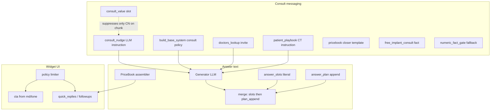

# Marketing Hooks Audit

**Статус:** read-only inventory (2026-06).  
**Цель:** собрать все места, где бот добавляет маркетинг, CTA, consult-текст, promo, quick replies, followups, price facts, deterministic append или LLM-инструкции.  
**Scope:** runtime + client pack (`clients/demo/` как reference). **Поведение не менялось** — только карта и proposal-рекомендации.

---

## 1. Порядок сборки ответа (content / chunk path)

Типичный turn после Generator (LLM):

```
LLM answer (chunk body)
  → deterministic append merge (chunk_responder):
       slots_text (clinic_note, consult_value, promo_note)  — первым
       plan_append / generator_append_text (price_offer, payment_terms) — вторым
  → numeric_fact_gate (если включён)
  → policy (followups / quick_replies / CTA / video / situation slots)
  → sanitize_ungrounded_continuation_invites
```

Price / `service_reply` path: ответ часто **полностью deterministic** (`assemble_price_answer`, `build_service_facts_card_payload`, `guided_menu_payload`, `patient_playbook` synthetic chunk → LLM).

См. `chunk_responder._apply_answer_slots_and_price_append`, `ux_builder.build_ask_response`, `policy.apply_response_policy`.

---

## 2. Источники (таблица)

Легенда колонок:
- **Literal** — текст вставляется дословно в `answer` или UI
- **LLM** — влияет на формулировку через промпт / structured facts
- **CTA/Promo/Price** — может ли дать консультацию, CTA, промо или ценовой факт

| # | Источник | Где лежит текст | Где применяется | Literal / LLM | CTA / Promo / Price | Риск дубля | Рекомендация |
|---|----------|-----------------|-----------------|---------------|---------------------|------------|--------------|
| 1 | **MD `clinic_note`** | `clients/{id}/md/**/*.md` frontmatter | `meta_loader` → `assemble_answer_slots` → append после LLM | **Literal** (абзац) | Мягкий clinic positioning; не CTA-кнопка | **medium** с consult_nudge / consult_value | **keep** + gate по cooldown (`answer_slots.cooldown_turns`) |
| 2 | **MD `consult_value`** | md frontmatter (+ `h3_overrides`) | `assemble_answer_slots` (literal append); **только на chunk path** suppresses `consult_nudge` (`doc_meta_has_consult_value` → `_consult_nudge_addon`) | **Literal** (append) + **narrow suppress** consult_nudge | Consult framing | **high** vs consult_nudge on same chunk; **не** глушит global LLM policy, pricebook facts, doctors_lookup, patient_playbook | **keep** slot; **gate** content density (см. R3) |
| 3 | **MD `promo_note`** | md `{text, active_until?}` | `assemble_answer_slots` only if `is_commercial_intent` and not `is_promo_blocked` | **Literal** | Promo | **medium** vs pricebook `promo` / facts | **gate** — один promo channel per turn (md XOR pricebook) |
| 4 | **MD `h3_overrides`** | per-h3 overrides for clinic_note / consult_value / promo_note | `_effective_slot_fields` in `core/answer_slots.py` | **Literal** | Same as parent slot | **low** | **keep** |
| 5 | **MD `cta_key` / `cta_action` / `cta_text` / `cta_from_turn`** | md frontmatter | `meta_loader` → `ux_builder.build_cta` → `lead_cta_dict_from_meta` → widget `cta`; gated by `policy` (`cta_from_turn`, booking) | **Literal** (кнопка, не в answer) | **CTA** (lead) | **medium** vs consult_nudge text in answer | **keep**; review `cta_from_turn` defaults per doc type |
| 6 | **MD `suggest_h3`** | md frontmatter list | `build_followups` → `meta.followups`; policy shows ≤1–2; marks `covered_h3_ids` | **Literal** (кнопки followup) | Navigation, not promo | **low** | **keep** |
| 7 | **MD `suggest_refs`** | md frontmatter | `build_quick_refs` → `quick_replies`; policy defers/shows 1 on exhaust | **Literal** (кнопки) | Cross-doc navigation | **medium** vs price followups | **keep**; dedup via `hide_navigated_quick_replies` |
| 8 | **MD `empathy_enabled`** | frontmatter flag | `llm.build_messages_for_gpt` → `EMPATHY_ADDON` in system prompt | **LLM** | Soft tone, not hard CTA | **low** | **keep** |
| 9 | **MD `situation_allowed` / `video_key`** | frontmatter | `policy.build_policy_decision` → situation block / video payload | UI slots | Lead-adjacent | **low** | **keep** |
| 10 | **`answer_slots` assembly** | `core/answer_slots.py` | Order: clinic_note → consult_value → promo_note; max chars in `routing.yaml` | **Literal** append | см. slots | **medium** internal between slots | **keep** order; **gate** promo (row 3) |
| 11 | **`generator_append_text` merge** | orchestration (`price_flow`, etc.) + `answer_plan` | `merge_deterministic_appends(slots_text, generator_append_text=plan_append)` — **порядок: slots → plan_append** | **Literal** | Price tail | **high** if price in LLM + append | **gate** — см. answer_plan `price_offer` suppress if ₽ in body |
| 12 | **`consult_nudge` (exhausted / streak)** | `clients/{id}/ui.yaml` → `consult_nudge.*_prompt`; fallback in `client_config_loader` | `plan_consult_nudge` → `meta.consult_nudge` → `llm._consult_nudge_addon` / `generate_facts_card_answer`; **chunk path only** | **LLM instruction** (не готовый абзац) | Consult invite in answer | **high** vs `consult_value` on same chunk; independent of doctors_lookup / playbook / base system | **keep** + strict suppress when `consult_value` on chunk |
| 13 | **`consult_nudge` feature flag** | `clients/{id}/features.yaml` `consult_nudge.enabled` | `consult_nudge_enabled()` gates planning + prompt addon | Config | — | — | **keep** |
| 14 | **`features.messaging.free_consultation`** | `clients/{id}/features.yaml` | `core/llm_system_prompt.build_base_system` → `_CONSULT_POLICY_FREE` vs `_NEUTRAL` on **every** Generator call; also `doctors_lookup` | **LLM** (global consult policy) | Consult «бесплатная» claim | **high** vs `consult_value`, facts, consult_nudge | **keep** as client flag; **gate** overlap with literal consult slots |
| 15 | **LLM `RESPONSE_FORMAT` / `EMPATHY_ADDON`** | `llm.py` hardcoded | All chunk Generator calls via `build_messages_for_gpt` | **LLM** | Indirect (tone, no fake continuation) | **low** | **keep** in code; not client YAML |
| 16 | **LLM `facts_card` system** | `llm._FACTS_CARD_SYSTEM` | `ux_builder.build_service_facts_card_payload` when catalog `response_mode: card` | **LLM** from catalog `facts[]` | May add consult via consult_nudge addon | **medium** vs consult_value on md path | **keep**; facts must stay factual |
| 17 | **Pricebook `intro_text`** | `clients/{id}/pricebook/services/*.json` | `core/price_answer_assembler._complex_intro` / `_template_intro` | **Literal** (or code template if empty) | Price framing | **medium** vs LLM price concern chunk | **rewrite** client intros; **gate** code fallbacks (`all_on_4` template) to pricebook only |
| 18 | **Pricebook `promo`** | service JSON `{text}` | `_render_promo` in `assemble_price_answer` (`promo_slot` block) | **Literal** | **Promo** | **high** vs md `promo_note` | **gate** — single promo source per route |
| 19 | **Pricebook `fact_refs` + `facts.json`** | `pricebook/facts.json` (`text_fact`, `render_mode`, `followup_label`, `usable_in`) | `resolve_fact_refs` → strict bullets or natural prose in price answer; `fact_followups_to_quick_replies` | strict=**Literal**; natural=**Literal** (today; comment says LLM later) | Payment/warranty/consult facts | **high** for installment + payment_terms append | **keep** facts central; **gate** `payment_terms` append when facts overlap |
| 20 | **Pricebook `followups`** | service JSON `followups[]` | `followups_to_quick_replies` / `merge_price_quick_replies` | **Literal** (buttons) | Price navigation | **medium** vs manifest group overview | **keep** |
| 21 | **Pricebook `recommended` + `includes`/`excludes`** | variant objects in service JSON | `render_price_offers_append`, stages/includes blocks | **Literal** price marketing | **Price** facts | **low** | **keep** |
| 22 | **Pricebook closer template** | `core/price_answer_assembler._template_closer` (code) | Appended on price answers: «Точный план… после осмотра и консультации» | **Literal** | Consult | **high** vs consult_nudge + consult_value | **rewrite** → client `facts.json` or **move** to centralized closer policy |
| 23 | **Legacy `price_offers.render_price_offers_append`** | built from offers / catalog prices | `build_price_append_for_lookup`, orchestration `generator_append_text`; also answer_plan `price_offer` | **Literal** | **Price** | **high** if PriceBook v2 also applied | **gate** — prefer PriceBook assembler; legacy append only fallback |
| 24 | **`answer_plan` → `price_offer` append** | `core/answer_planner.py` (regex aspects) | `apply_answer_plan_append` → `build_price_append_for_lookup` | **Literal** | **Price** | **high** on content+price turns | **gate** — suppress if answer already has ₽ or stages |
| 25 | **`answer_plan` → `payment_terms` append** | hardcoded ref `clinic__info__payment_terms.md#korotko` | `render_payment_terms_append` | **Literal** (chunk body) | Installment / tax | **high** vs `installment_12` fact | **gate** — existing `suppress_payment_terms`; **keep** |
| 26 | **`service_catalog.facts`** | `clients/{id}/service_catalog.json` | `build_service_facts_card_payload` → LLM or bullet fallback | **LLM** or literal bullets | Service marketing | **low** per service | **keep**; audit facts for medical promises |
| 27 | **`service_catalog.suggest_refs`** | catalog entry | `_suggest_refs_at_most_one` in facts card / price payloads | **Literal** (≤1 QR) | Navigation | **low** | **keep** |
| 28 | **`service_catalog.concern_ref` / `price_ref` / `price_display`** | catalog | A3 `price_concern` / content price line (`service_price_line_for_content` if `always`) | md chunk LLM or deterministic price line | **Price** / concern | **medium** | **keep**; concern_ref default gap in TECH_DEBT |
| 29 | **`ux_builder.build_ask_response`** | assembles QR + followups + CTA from meta | All successful chunk responses | Mixed UI | CTA + navigation | Aggregator — dups from rows 5–7 | **keep** as single UI assembly point |
| 30 | **`policy.build_policy_decision`** | code limits | Max 1–2 followup slots; video vs situation vs refs; hides CTA if booking | UI limiter | CTA / situation | Reduces duplicate UI | **keep** — primary anti-spam layer |
| 31 | **`policy` CTA gating** | `cta_from_turn`, `booking_intent`, lead/situation pending | Hides `payload.cta` | — | **CTA** | **low** | **keep** |
| 32 | **`dialog_offer.sanitize_ungrounded_continuation_invites`** | code regex | Strips fake «могу рассказать ещё» if no structural followups | Answer text cleanup | Anti-fake-continuation | **low** | **keep** |
| 33 | **`guided_menu`** | `clients/{id}/ui.yaml` + `widget_config` | Resolver unknown+clarify → `guided_menu_payload` (`retrieval_flow`) | **Literal** answer + QR | Soft menu / lead QR | **low** | **keep** |
| 34 | **`fallback_menu.low_score` / `no_candidates` / `offtopic`** | `ui.yaml` | `retrieval_flow` service_reply routes | **Literal** | Consult CTA in text | **medium** vs consult_nudge on edge paths | **rewrite** client copy; **gate** consult claims |
| 35 | **`continuation_clarify` / `bare_affirmative`** | `ui.yaml` / `tone.yaml` via `_FALLBACK_TXT` | `pre_resolver_turn` | **Literal** | — | **low** | **keep** |
| 36 | **Lead flow texts** | `tone.yaml` / `lead_config.yaml` | `flow_handlers`, `lead_flow` | **Literal** | **CTA** / lead | **low** on lead path | **keep** (separate flow) |
| 37 | **`tone.yaml` `lead.cta_variants`** | label + name_prompt per key | `lead_cta_dict_from_meta` when `cta_key` matches | **Literal** CTA label | **CTA** | **low** | **keep** — central CTA registry |
| 38 | **`price_group_overview`** | `pricebook/manifest.json` groups (`overview_prompt`, members) | `build_group_overview_answer` on unit_clarify / vague jaw price | **Literal** intro + price lines + QR | **Price** menu | **medium** vs `patient_playbook` on content | **keep** for price route; don't merge with playbook |
| 39 | **`patient_playbook.yaml`** | `clients/{id}/patient_playbook.yaml` — strategy, roles, positioning, `answer_style` | `select_patient_options` → synthetic chunk JSON + `build_patient_options_llm_question` (`mention_consult_ct`) | **LLM** (no canned paragraphs in YAML) | Overview + consult/CT instruction | **medium** vs single-doc retrieval; **not** gated by md `consult_value` | **keep** (strategy only); **move** closer/CTA rules to centralized policy when multiclient grows |
| 40 | **`patient_playbook` quick replies** | derived from catalog/pricebook display names | `patient_options_quick_replies` → `chunk_responder._apply_patient_playbook_ui` | **Literal** `price:{sid}` buttons | Price navigation | **low** | **keep** |
| 41 | **`patient_playbook` factual_snippets** | catalog `facts[]` + pricebook `intro_text` (not YAML copy) | Embedded in LLM context JSON only | **LLM** grounding | Factual | **low** if snippets factual | **keep**; audit snippet sources |
| 42 | **`widget_config` / launcher** | `clients/{id}/widget_config.json`, `brand.yaml` | Widget shell only (not answer body) | UI chrome | Marketing chrome | — | **keep** out of answer pipeline |
| 43 | **`pick_relevant_offer` stub** | `ux_builder` returns `None` | — | — | — | — | **remove** dead code when confirmed unused |
| 44 | **`numeric_fact_gate`** | `core/numeric_fact_gate.py` — `_BLOCKED_FALLBACK` (code) | Post-append scrub ungrounded ₽/%/months; on `blocked` replaces answer with consult-like fallback | **Safety** layer; fallback **visible** to patient | Consult-like redirect when blocked | **medium** vs other consult channels on same turn | **keep** as safety; **not** pure marketing — review fallback copy in centralized policy |
| 45 | **`doctors_lookup` LLM question** | `doctors_lookup.build_doctors_list_llm_question` (code) | Doctors list route → synthetic chunk → Generator; `invite` tail depends on `free_consultation_messaging` | **LLM instruction** | **Consult** invite («бесплатная» if flag) | **high** vs global `_CONSULT_POLICY_*`, consult_value, consult_nudge | **gate** consult budget on doctors route; **not** suppressed by md `consult_value` |
| 46 | **`clinic_policies_loader`** | `clients/{id}/clinic_policies.yaml` — `service_not_offered_template`, `service_alternatives[]` (`note`, `match_keywords`, `suggest_ref`) | `ingress_gate` route `service_not_offered` → `build_service_not_offered_answer` + `service_alternative_quick_replies` | **Literal** answer (+ QR) | Soft redirect / alternative service | **low** vs md slots | **keep**; audit template consult claims in client YAML |

---

## 3. Детали по зонам

### 3.1 MD frontmatter (`meta_loader.py`)

Поля читаются в `get_doc_meta()` / chunk meta:
- `clinic_note`, `consult_value`, `promo_note`, `h3_overrides`
- `cta_key`, `cta_action`, `cta_text`, `cta_from_turn`, `cta_mode`
- `suggest_h3`, `suggest_refs`
- `empathy_enabled`, `situation_allowed`, `video_key`

**Применение:** content/chunk path primarily; CTA/suggest → UI via `ux_builder` + `policy`.

### 3.2 Answer slots + append order (`chunk_responder.py`)

```text
slots_text = assemble_answer_slots(...)       # clinic_note → consult_value → promo_note
plan_append = apply_answer_plan_append(...)   # price_offer, payment_terms
combined = merge_deterministic_appends(
    slots_text=slots_text,
    generator_append_text=plan_append,
)
# Фактический порядок в ответе: slots_text, затем plan_append (хвост цены/оплаты)
answer += combined
```

Cooldown per slot kind in session (`record_answer_slots_shown`). Telemetry: `meta.answer_slots`.

### 3.2a Scope `consult_value` suppress

`doc_meta_has_consult_value` **только** отключает `consult_nudge` addon на **chunk Generator path** (`llm._consult_nudge_addon`).

**Не подавляет:**
- глобальную consult policy в `build_base_system` (`features.messaging.free_consultation`)
- PriceBook `fact_refs` / closer (price path)
- `doctors_lookup.build_doctors_list_llm_question` (явное «заверши консультацией»)
- `patient_playbook` `build_patient_options_llm_question` (`mention_consult_ct`)
- ingress `clinic_policies` templates с consult wording
- `numeric_fact_gate` `_BLOCKED_FALLBACK`

Итого: `consult_value` — локальный антидубль для `consult_nudge` на md-chunk, не общий consult budget.

### 3.3 Consult nudge (`core/consult_nudge.py`)

- **Не вставляет готовый текст** — только LLM instruction from `ui.yaml`.
- Triggers: topic exhausted (`suggest_h3` covered) OR consult streak ≥ 2 on substantive routes.
- Suppressed when: `consult_value` in doc (**chunk path only**), lead context, non-substantive route.
- `patient_options_overview` **not** in `_SUBSTANTIVE_ROUTES` — consult_nudge по streak там не планируется; playbook уже несёт consult/CT instruction в своём LLM question (см. R8).

### 3.4 PriceBook v2 (`core/price_answer_assembler.py`)

Block order (typical complex price):
`intro` → `price_table` → `promo_slot` → `fact_refs` → `closer` → followups as QR.

Code templates in `_complex_intro` / `_template_closer` apply when client fields empty — **marketing text in code**.

### 3.5 Legacy price_offers (`core/price_offers.py`)

Still used for append tails and when PriceBook assembly returns None. `recommended` suffix on offers is code (`_recommended_offer_suffix`).

### 3.6 Service catalog (`service_catalog.json`)

- `facts` → catalog_facts LLM card
- `suggest_refs` → max 1 quick reply on facts/price payloads
- `price_display: always` → appends price line to catalog_facts answer (`catalog_flow.try_a3_catalog_facts`)

### 3.7 Policy limiter (`policy.py`)

Marketing-relevant decisions:
- Max followups: 2 (or 1 if video)
- `show_cta`, `show_video`, `show_situation`, `show_refs` (deferred refs)
- Drops CTA when `booking_intent` or before `cta_from_turn`
- `sanitize_ungrounded_continuation_invites` on answer

### 3.8 Tone / UI fallbacks (`tone.yaml`, `ui.yaml`)

| File | Marketing-heavy entries |
|------|-------------------------|
| `ui.yaml` | `guided_menu`, `fallback_menu.low_score` (consult + installment claims), `consult_nudge` prompts |
| `tone.yaml` | `lead.cta_variants`, lead/situation prompts |

Loaded via `core/client_config_loader.load_ui_bundle` / `load_tone`.

### 3.9 Patient playbook (Slice 5)

| Asset | Role |
|-------|------|
| `patient_playbook.yaml` | Priority, `strategy`, `positioning`, `answer_style` flags — **no patient-facing copy** |
| `build_patient_options_llm_context` | JSON for Generator source |
| `build_patient_options_llm_question` | Instruction: multi-option overview, avoid single winner, mention CT/consult |
| `factual_snippets` | From catalog/pricebook only |

Route: `patient_options_overview` (synthetic chunk, same Generator stack as retrieval).

### 3.10 Doctors list (`doctors_lookup.py`)

| Piece | Role |
|-------|------|
| `build_doctors_list_llm_question` | User-message instruction for Generator: list doctors + **mandatory consult closer** |
| `free_consultation_messaging(client_id)` | If true: «Заверши приглашением на **бесплатную** консультацию»; else neutral wording |

Отдельный маршрут от md-chunk; **не** связан с `doc_meta_has_consult_value`. Может дублировать global `_CONSULT_POLICY_FREE` в system prompt.

### 3.11 Clinic policies (`core/clinic_policies_loader.py`)

| Field | Application |
|-------|-------------|
| `service_not_offered_template` | `build_service_not_offered_answer` — deterministic answer when ingress `service_not_offered` |
| `service_alternatives[].note` | If keyword match — **replaces** template (alternative pitch) |
| `service_alternatives[].suggest_ref` | `service_alternative_quick_replies` → ingress `quick_replies` |

Code fallback in `build_service_not_offered_answer` (no YAML): «…записать на консультацию».

---

## 4. Proposal-рекомендации (без изменения кода)

Формат: **action** — why, duplicate_risk, confidence, needs_human_review.

### R1 — Single promo channel per turn
- **action:** gate  
- **why:** `promo_note` (md) и PriceBook `promo` могут оба сработать на commercial turns разными путями.  
- **duplicate_risk:** high  
- **confidence:** medium  
- **needs_human_review:** true  

### R2 — Consult closer consolidation
- **action:** move to centralized marketing policy  
- **why:** PriceBook `_template_closer`, `consult_value` slots, `consult_nudge` LLM, facts `free_implant_consult` — четыре канала «приходите на консультацию».  
- **duplicate_risk:** high  
- **confidence:** high  
- **needs_human_review:** false  

### R3 — Keep answer_slots mechanism; review content density
- **action:** keep (mechanism) + **rewrite** (client md density)  
- **why:** Cooldown/gating работают; `consult_value` корректно глушит только `consult_nudge` на chunk path. Но **нормой не считать** `clinic_note` + `consult_value` на каждом service-doc — перегруз consult на каждом turn.  
- **duplicate_risk:** medium  
- **confidence:** high  
- **needs_human_review:** true (per-doc content audit in `clients/demo/md/**`)  

### R4 — Pricebook intro/closer in client pack only
- **action:** rewrite (+ remove code templates over time)  
- **why:** `_complex_intro` hardcodes All-on-4/6/classic marketing sentences in Python.  
- **duplicate_risk:** medium  
- **confidence:** high  
- **needs_human_review:** false  

### R5 — answer_plan price_offer gate
- **action:** keep existing suppress rules; extend telemetry  
- **why:** Prevents ₽ block twice (LLM body + append).  
- **duplicate_risk:** high when misconfigured  
- **confidence:** high  
- **needs_human_review:** false  

### R6 — payment_terms vs installment fact
- **action:** keep gate (`suppress_payment_terms`)  
- **why:** `installment_12` fact + full payment_terms chunk duplicate.  
- **duplicate_risk:** high  
- **confidence:** high  
- **needs_human_review:** false  

### R7 — patient_playbook stays strategy-only
- **action:** keep  
- **why:** Recent refactor removed YAML canned copy; LLM writes live answer.  
- **duplicate_risk:** medium vs retrieval single-doc  
- **confidence:** high  
- **needs_human_review:** false  

### R8 — Centralized consult budget for `patient_options_overview`
- **action:** review centralized consult budget (default: **do not** add extra `consult_nudge` while playbook already has consult/CT instruction)  
- **why:** `build_patient_options_llm_question` уже просит КТ/консультацию (`mention_consult_ct`); route не в `_SUBSTANTIVE_ROUTES` — streak-based consult_nudge не добавляется. Риск — не недобор, а **перебор** consult, если позже включат route в substantive list без budget check.  
- **duplicate_risk:** medium  
- **confidence:** medium  
- **needs_human_review:** true  

### R9 — low_score fallback consult claims
- **action:** rewrite client copy  
- **why:** `ui.yaml` low_score mentions free consult + installment — heavy marketing on failure path.  
- **duplicate_risk:** medium  
- **confidence:** medium  
- **needs_human_review:** true  

### R10 — Centralize CTA registry
- **action:** keep `tone.yaml` cta_variants as source of truth  
- **why:** Already maps `cta_key` → label; md only references keys.  
- **duplicate_risk:** low  
- **confidence:** high  
- **needs_human_review:** false  

### R11 — Remove `pick_relevant_offer` stub
- **action:** remove (future PR)  
- **why:** Always `None`; TECH_DEBT mentions promo via promo_note instead.  
- **duplicate_risk:** none  
- **confidence:** high  
- **needs_human_review:** false  

### R12 — facts.json `render_mode: natural` in price answers
- **action:** keep; optionally move to LLM paraphrase layer later  
- **why:** `free_implant_consult` is long consult promo as natural prose in deterministic price block.  
- **duplicate_risk:** high vs consult_nudge on price_lookup  
- **confidence:** medium  
- **needs_human_review:** true  

---

## 5. Карта дублирования (кратко)



---

## 6. Файлы для следующего шага (human review)

1. `clients/demo/ui.yaml` — `fallback_menu.low_score`, `consult_nudge` prompts  
2. `clients/demo/pricebook/facts.json` — `free_implant_consult`, `installment_12`  
3. `core/price_answer_assembler.py` — `_template_closer`, `_complex_intro` code templates  
4. Centralized **consult budget** — `patient_options_overview` vs playbook CT instruction vs consult_nudge (R8)  
5. `clients/demo/md/**` — density of `clinic_note` + `consult_value` per service doc (R3)  
6. `clients/demo/clinic_policies.yaml` — `service_not_offered_template`, alternatives  
7. `doctors_lookup.build_doctors_list_llm_question` — consult closer vs `free_consultation` flag  

---

## 7. Out of scope (не marketing hooks)

- Resolver / ingress classification prompts (кроме deterministic `clinic_policies` answer на `service_not_offered`)  
- Verifier (safety, not marketing)  
- `data/demo/*` build artifacts  
- Widget streaming UI labels (`static/widget/`)

---

*Документ создан как proposal-only audit. Изменения runtime и client content — отдельные PR.*
