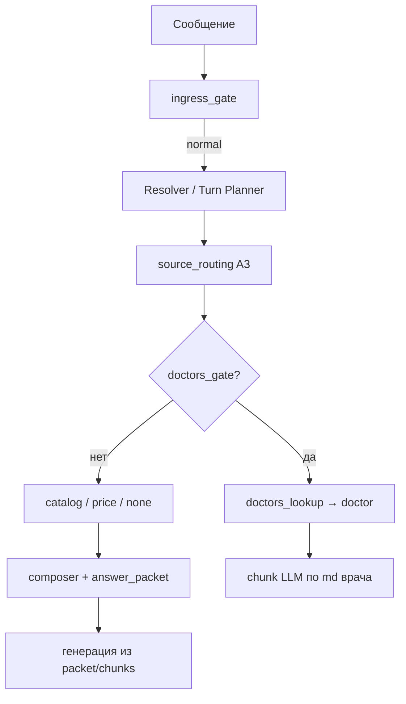

# Фаза 1 — отчёт: интент «Доверие» (demo)

**Задача:** `TASK.md` — интент «Доверие» (social-proof / доверие к клинике)  
**Статус:** разведка завершена, код **не** писался  
**Следующий шаг:** утверждение Клодом → Фаза 2 (реализация)

---

## 1. Как сейчас маршрутизируются интенты

### Цепочка (упрощённо)



### Слои и роли

| Слой | Файл | Что решает |
|------|------|------------|
| Ingress | `ingress_gate.py` | hard_stop / manual_contact / policy / service_not_offered / **normal** |
| Intent | `resolver.py`, `orchestration/resolver_turn.py`, `llm.classify_intent` | `route_intent`: content \| price_lookup \| price_concern \| unknown |
| Пороги | `core/routing.yaml` | confidence для ingress, resolver, numeric_fact_gate и т.д. |
| A3 routing | `source_routing.py` | **doctors_gate** (первый приоритет) → catalog_facts/md → price_* → **none** |
| Price rules | `query_selector.py` | regex `PRICE_*` **до** Resolver; гарантия попадает в aspect `warranty`, не в отдельный интент |
| Orchestration | `orchestration/ask_turn.py` | contacts → A3 → doctor → composer → catalog_facts → price |

**Отдельного интента «Доверие» нет.** В roadmap (`docs/FULLCONTEXT_ROADMAP.md`) он помечен 🟡 как `clinic_proof`, но в runtime не подключён.

### Куда попадают trust-вопросы сегодня

Проверено empiric на 12 типовых формулировках (`doctors_lookup` + `doctor_intent_probe`):

| Вопрос | doctors_lookup | Куда реально |
|--------|----------------|--------------|
| «Кто делает имплантацию?» | ✅ cards | **doctors_lookup** (как задумано) |
| «Расскажите про врача Орлова» | ✅ doc | **doctors_lookup** |
| «Врачи опытные?», «Какой стаж/опыт у врачей?» | ❌ | **composer/RAG** (`source=none`) |
| «Есть отзывы?», «Почему вам доверять?», «Почему выбрать клинику?» | ❌ | **composer/RAG** → часто `advantages` / `overview` / случайный chunk |
| «Сколько лет клинике?» | ❌ | **composer/RAG** (нет явного doc «возраст клиники») |
| «Какая гарантия?» | ❌ | aspect **warranty** → `clinic__info__warranty.md` (не trust) |
| «Боюсь, что не приживётся» | ❌ | ingress **normal** → content (не manual_contact) |
| «Сколько стоит имплант и врачи опытные?» | ❌ | price regex → **price path** |

**Вывод:** social-proof сейчас — побочный эффект RAG/composer, без детерминированного якоря. `doctor_intent_probe` покрывает **staffing** («кто делает X»), но **не** типичные trust-формулировки («опытные?», «стаж?», «отзывы?»).

---

## 2. Что уже есть в базе (не дублировать)

### `doctors_lookup.py` (интент «врачи», не «доверие»)

- Детерминированный индекс `clients/{id}/md/doctors__doctor__*.md`
- Роутинг: **doc** (1 врач) / **cards** (2–3) / **overview** (4+)
- Поля: `experience_years`, `position`, `#korotko`, привязка к `services` из каталога
- Probe: имена, специальности, «кто делает имплантацию» — **не** «почему доверять»

**Demo — 6 врачей, стаж во frontmatter:**

| Врач | `experience_years` |
|------|-------------------|
| Морозова | 11 |
| Григорьев | 12 |
| Волков | 13 |
| Фёдорова | 16 |
| Орлов | 16 |
| Кузнецов | 19 |

**`doctors__doctor__overview.md`:** команда 6 чел.; суммарный стаж **>85 лет**; индивидуально **11–19 лет**; приживаемость **99,8%**; совместное ведение сложных случаев; цифровая диагностика.

### Гарантии / опыт клиники / «отзывы»

| Источник | Факты (дословно из базы) |
|----------|--------------------------|
| `clinic__info__warranty.md` | Работа врача **1 год**; Nobel/Impro — **пожизненная**; Implantium — **5 лет**; перестановка при неприживлении бесплатно |
| `pricebook/facts.json` → `implant_warranty` | Тот же якорь, strict render |
| `clinic__info__advantages.md` | «**Высокие оценки** на независимых площадках и **отзывах** пациентов» — **без цифр/ссылок** |
| `implantation__faq__osseointegration.md` | **99,8%** за **26 лет** работы |
| `clinic__info__technology.md` | 99,8%; своя лаборатория; 1–3 дня на коронки |
| `clinic__info__consultation.md` | Консультацию ведёт врач с **20-летним стажем**, **>20 000** операций |
| `implantation__service__benefits.md` | Стаж команды 11–19 лет; гарантии по договору |

**Чего в базе нет:** конкретных отзывов (тексты, имена, рейтинг 4,9), отдельного doc «N лет клинике на рынке» (есть **26 лет работы** в osseointegration).

### `marketing.yaml` → `clinic_proof`

- 10 service-scoped фраз «почему к нам» (имплантация, синус-лифт и т.д.)
- **Загружается** (`core/marketing_loader.py`), но **в ответы не вставляется** (roadmap: ждёт `reassurance`/trust)
- **Не смешивать** с md в одном ответе без правила приоритета — guardrails §0.3

---

## 3. Предложение дизайна

### 3.1. Границы интента `trust` (clinic_proof)

**Ловим (deterministic probe + опционально Resolver `service_topic=clinic`, `query_mode=specific|overview`):**

- Опыт/стаж **в агрегате**: «врачи опытные?», «какой стаж?», «насколько опытные специалисты?»
- Social proof клиники: «почему вам доверять?», «почему выбрать вас?», «надёжная ли клиника?»
- Отзывы/репутация: «есть отзывы?», «какой рейтинг?» (без выдуманных цифр)
- Track record: «сколько лет клинике/работаете?», «делали такое раньше?» (общий опыт, не диагноз)
- Приживаемость как доверие: «можно ли вам доверять с имплантами?» (не страх-консультация)

**НЕ trust (явные исключения):**

| Класс | Пример | Владелец |
|-------|--------|----------|
| Staffing | «Кто имплантолог?», «Кузнецов чем занимается?» | `doctors_lookup` |
| Гарантия как аспект | «Какая гарантия?», «гарантия на коронку» | aspect **warranty** → `warranty.md` |
| Цена | «Сколько стоит + опытные врачи?» | **price** wins (`price_rules_hint` первым) |
| Медзона / страх | «подойдёт ли мне», «боюсь осложнений», «у меня диабет» | content / hand-off, **не** social proof |
| Жалоба | «хочу оставить отзыв-претензию» | ingress **manual_contact** |
| Процесс | «как проходит имплантация?» | content process |

**Приоритет в A3:** `price_*` > `doctors_gate` (если staffing) > **`trust_gate`** > catalog > composer.

### 3.2. Форма ответа

**Структура (1 LLM-ход по synthetic chunk, как doctors cards):**

1. **Прямой ответ** на угол вопроса (1–2 предложения)
2. **2–4 факта** только из trust-bundle (ниже)
3. **CTA** — бесплатная консультация (`clinic__info__consultation.md` / promo `free_implant_consult`), без дублирования policy

**Trust-bundle (demo, фиксированный whitelist refs):**

```
doctors__doctor__overview.md#korotko          — команда, стаж 11–19 / 85+, 99,8%
clinic__info__warranty.md#korotko             — 1 год / пожизненная / 5 лет
clinic__info__advantages.md#korotko           — оценки и отзывы (качественно)
implantation__faq__osseointegration.md#korotko — 99,8% за 26 лет
[+ опционально clinic__info__technology.md#korotko — лаборатория, 3D]
```

**Service context:** если есть уверенный `service_id` из сессии/каталога — **добавить одну** фразу из `marketing.yaml` → `clinic_proof[service_id]` как доп. карточку (strict, дословно). Без service_id — только md-bundle.

**Инварианты:** `numeric_fact_gate` pass; не смягчать «без боли», «99,8%», «1 год»; не добавлять «4,9 на Яндексе», если этого нет в bundle.

### 3.3. Пустая / частичная база

| Ситуация | Поведение |
|----------|-----------|
| Нет trust-md / пустой bundle | **Тёплый hand-off:** «подробнее расскажет врач на бесплатной консультации» + CTA; **ноль** выдуманных цифр/отзывов |
| Есть overview, нет warranty | Только стаж/команда; гарантию **не** упоминать |
| «Отзывы?», в базе только advantages | Фраза про «высокие оценки…» **дословно**; не invent count/platform |
| «Сколько лет клинике?» | Если есть osseointegration → **«26 лет работы»**; иначе hand-off |
| Клиент без `doctors__*` | trust по clinic-level md; блок про врачей опустить |

---

## 4. Eval-кейсы для Фазы 2 (новая группа `trust`)

| ID | Вопрос | Ожидание |
|----|--------|----------|
| **T1_experience** | «Какой стаж у ваших врачей?» | route=`trust`; в ответе **11** и **19** или **85** (overview); **не** полный список врачей |
| **T2_reviews** | «Есть отзывы о клинике?» | route=`trust`; фраза про **оценки/отзывы** из advantages; **нет** «4,9», «500 отзывов» |
| **T3_why_trust** | «Почему вам можно доверять?» | route=`trust`; **99,8%** + стаж команды; CTA консультация |
| **T4_clinic_age** | «Сколько лет клинике?» | route=`trust`; **26 лет** (osseointegration); не выдуманный «15 лет на рынке» |
| **T5_doctors_regression** | «Кто делает имплантацию?» | route=**doctor** (doctors_lookup), **не** trust |
| **T6_warranty_boundary** | «Какая гарантия на импланты?» | **warranty** aspect / `warranty.md`, **не** trust |

---

## 5. Открытые вопросы на решение Клода

1. **Имя в коде:** `trust` vs `clinic_proof` vs `route_intent=content` + `source=trust`?
2. **`clinic_proof` из marketing.yaml:** включать в Фазу 2 или только md-bundle (минимальный риск)?
3. **«Делали такое раньше?»** с контекстом услуги (имплантация) — trust + service `clinic_proof`, или только overview?
4. **Расширять `doctor_intent_probe`** для «стаж у врачей» или **не трогать** doctors и вести через отдельный trust?

---

## 6. Рекомендация (для утверждения)

- Новый **`source=trust`** в A3 с deterministic probe; **не** расширять doctors_lookup на trust.
- Ответ — synthetic chunk из **whitelist md** (+ опционально один `clinic_proof` при service context).
- Явные границы с price / warranty / doctors / medzone — как в таблице §3.1.
- Eval-группа **T1–T6** выше.

**СТОП — ждём решения по §5, только потом Фаза 2.**
