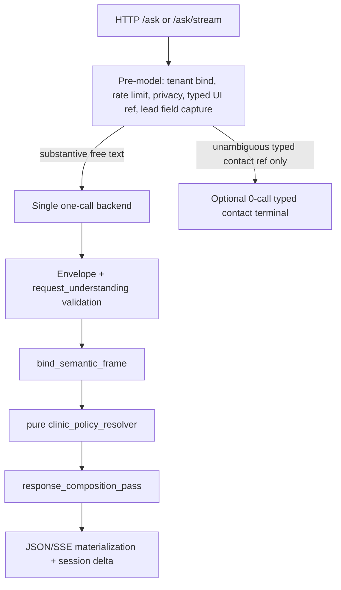

# D1R — model understanding + code-owned clinic rules (integration design)

Checkpoint **A** (design only). Baseline `70696ca80d9a1c9f3a15a3472cccb800215a06bf`. Branch `codex/demo-d1-clinic-policy`. Prior implementation checkpoint `aaf9eaa` is **rejected** as product approach (regex/heuristic policy authority); it remains in Git as evidence until checkpoint B replaces it.

Architect decision (fixed): one existing model call; structured `request_understanding` in the envelope; code applies authored clinic policies and owns price/contact/policy blocks. No second LLM, no regex/substring business classifier, no contradiction filtering of model prose for policy facts.

---

## 1. Typed contract: `request_understanding`

Single new top-level envelope field (checkpoint B). Provenance: model JSON only → validated → copied into `SalesOnePlusSemanticFrame` by `bind_semantic_frame`. Never re-parsed from `patient_text` or user message in code.

### 1.1 Pydantic types (final for B)

New module `contracts/request_understanding.py` (recommended) imported by envelope and semantic frame.

```python
# Literal unions — program contract, not user phrase tables
SubjectRelation = Literal["self", "other", "unknown"]
AgeGroup = Literal["adult", "child", "unknown"]
RequestKind = Literal["clinic_policy", "booking", "price", "contact", "content", "other"]
RequestContext = Literal["current_care", "general_information", "past_history", "unknown"]
PaymentScheme = Literal["oms", "dms", "self_pay", "unspecified"]
PaymentSchemeIntent = Literal[
    "eligibility_question", "requested_payment", "not_requested", "unspecified"
]
# contact_fields: reuse existing contact aspect ids, e.g.
# "contact_phone" | "contact_whatsapp" | "contact_address" | "contact_hours"
# | "contact_parking" | "contacts"  (same set as turn contact contract)
```

**`RequestUnderstandingSubject`** (frozen, extra=forbid)

| Field | Type | Invariants |
|---|---|---|
| `subject_id` | `str` | Non-blank, unique within turn; pattern `s[1-9][0-9]*` |
| `relation` | `SubjectRelation` | Who the subject is relative to speaker |
| `age_group` | `AgeGroup` | No numeric age; `unknown` ≠ denial |

**`RequestUnderstandingRequest`** (frozen, extra=forbid)

| Field | Type | When required / notes |
|---|---|---|
| `request_id` | `str` | Unique; pattern `r[1-9][0-9]*`; stable order in list |
| `kind` | `RequestKind` | Drives resolver routing |
| `subject_id` | `str \| None` | Required for `booking`, `price`; optional for policy/contact |
| `context` | `RequestContext` | `past_history` must not set subject `age_group=child` alone |
| `policy_ids` | `tuple[str, ...]` | Only for `clinic_policy`; IDs must exist in pack or be empty (code may still apply rules from patient facts) |
| `payment_scheme` | `PaymentScheme` | For payment-related requests; default `unspecified` |
| `payment_scheme_intent` | `PaymentSchemeIntent` | OMS mention alone → not `requested_payment` |
| `contact_fields` | `tuple[str, ...]` | Only for `contact`; subset of allowed contact aspects |
| `content_text` | `str \| None` | Only for `content` / `other`; max length TBD same as patient_text budget |
| `primary_service_id` | `str \| None` | For `price` only; links to existing `service_id` authority (one primary service per price request; no multi-basket in D1R) |

**`RequestUnderstanding`** (frozen, extra=forbid)

| Field | Type | Invariants |
|---|---|---|
| `subjects` | `tuple[RequestUnderstandingSubject, ...]` | ≥1; at least one `relation=self` or explicit `other` child/adult |
| `requests` | `tuple[RequestUnderstandingRequest, ...]` | ≥1; ordered; every `subject_id` ref resolves |

**Envelope / frame**

- `OneCallEnvelope.request_understanding: RequestUnderstanding` — required on all production routes after contract v14.
- `SalesOnePlusSemanticFrame.request_understanding: RequestUnderstanding` — copied in `bind_semantic_frame` (provenance `"envelope"`).
- **Primary commerce service** for the turn remains existing `service_id` / `requested_service_id` / precomposer path; price requests must set `primary_service_id` on the price request row and align with envelope `service_id` when a single price is rendered (validator: at most one active price request with resolvable service, or route=CLARIFY).

No confidence field. `unknown` is explicit and distinct from negation.

### 1.2 Example envelope JSON (mixed OMS + adult CT price)

User: «По ОМС работаете? Если нет, сколько стоит КТ взрослому?»

```json
{
  "route": "ANSWER",
  "service_id": "ct",
  "extent": null,
  "jaw": null,
  "stage": null,
  "scenario": "none",
  "commercial_intent": "price",
  "promotion_scope": "none",
  "clarify_axis": null,
  "clarify_service_options": null,
  "patient_text": null,
  "price_text": null,
  "service_reference_status": "resolved",
  "requested_service_id": "ct",
  "references": { "direct_fact_ids": [] },
  "request_understanding": {
    "subjects": [
      { "subject_id": "s1", "relation": "self", "age_group": "adult" }
    ],
    "requests": [
      {
        "request_id": "r1",
        "kind": "clinic_policy",
        "subject_id": "s1",
        "context": "general_information",
        "policy_ids": ["no_oms"],
        "payment_scheme": "oms",
        "payment_scheme_intent": "eligibility_question",
        "contact_fields": [],
        "content_text": null,
        "primary_service_id": null
      },
      {
        "request_id": "r2",
        "kind": "price",
        "subject_id": "s1",
        "context": "current_care",
        "policy_ids": [],
        "payment_scheme": "unspecified",
        "payment_scheme_intent": "not_requested",
        "contact_fields": [],
        "content_text": null,
        "primary_service_id": "ct"
      }
    ]
  }
}
```

Code produces policy block for `r1` and code-owned price surface for `r2`; `patient_text` is not a fallback source for either block.

---

## 2. End-to-end call flow (free-text `/ask` and `/ask/stream`)



**Before model (unchanged scope + D1R removals in B)**

- Keep: session/client binding, rate limits, reset, privacy redaction, governed typed UI (scope/stage/service refs).
- **Remove in B:** `_try_deterministic_clinic_policy_terminal` and regex applicability in `one_call_clinic_policy_authority` on free-text path.
- **Lead:** if lead flow expects name/phone step, accept field via existing `handle_flows` / `lead_flow` without provider call (technical format checks only). If user sends a **new substantive question** while lead is open, do not classify via provider; either pause lead and run one-call, or complete lead step only when message matches expected field slot (documented in §5).
- **Contacts:** deterministic `_try_deterministic_contacts_terminal` **only** for unambiguous typed UI / explicit contact ref clicks — not for free-text address questions (those go through one-call).

**After model**

1. Parse + validate closed envelope including `request_understanding`.
2. `bind_semantic_frame` → semantic frame (+ understanding copy).
3. **`clinic_policy_resolver`** (new, pure): inputs = validated understanding + validated authored policies for tenant; outputs = per-`request_id` decision: `allowed_by_known_rules | blocked | needs_clarification | no_applicable_rule`.
4. **`build_one_call_presentation_result`** (extended): composition ledger per request; code-owned blocks for policy, price, contact; content slots from corpus via existing commerce/content paths tied to `request_id`; forbidden booking suppresses **all** CTA/quick-reply/lead transitions for blocked booking requests only.
5. Session write: store minimal **`VerifiedTurnUnderstanding`** snapshot (see §4) for follow-up turns — not full F1 memory.

**One-call budget**

- Free-text mixed policy/contact/price: **1** provider call (same as today).
- Typed UI contact click: **0** calls (unchanged).
- Lead name/phone step: **0** calls (unchanged).
- Invalid envelope: fail closed — no permission implied.

### 2.1 Mandatory interpretation scenarios (model output targets)

| User input (paraphrase) | Neutral `request_understanding` |
|---|---|
| Я взрослый, но хочу записать ребёнка | `other` subject `age_group=child`; `booking` for child; speaker adult does not cancel patient age |
| В детстве лечили зуб, теперь нужна коронка | `past_history` context; current child age not asserted |
| По ОМС работаете? Если нет, сколько стоит КТ взрослому? | `clinic_policy` OMS eligibility + `price` for adult + `primary_service_id=ct` |
| ОМС мне не нужен, сколько стоит КТ? | `payment_scheme_intent=not_requested` for OMS; price only |
| Принимаете детей и где находитесь? | `clinic_policy` pediatric + `contact` address |
| Сколько стоит лечение ребёнка? | `price` with child subject; code blocks offer, does not treat as bookable care |

---

## 3. Policy resolver and block ownership

**Input validation (D1R boundary on policies YAML)**

- At resolver entry: validate raw business policies; malformed authored rule → controlled error or safe answer without unconfirmed promise (distinct from missing optional policy).

**Resolver rules (pure, no regex on user text)**

- Map authored policy keys to structured checks (e.g. `no_pediatric_dentistry` + subject `age_group=child` + `booking|price` with child subject → `blocked` with authored text).
- Model may omit `policy_ids`; code still blocks child booking/price when subject facts require it.
- Absence of block does **not** prove service exists or OMS accepted — price/contact paths use catalog and payment data separately.
- Tenant without policy key: `no_applicable_rule` for that id; never inject Demo policies.

**Composition ledger** (per `request_id`)

| Status | Meaning |
|---|---|
| `answered` | Code block rendered |
| `blocked_with_explanation` | Authored or safe text |
| `clarification_needed` | Explicit ask (subject ambiguity) |
| `unsupported` | Honest limit (e.g. multi-service price basket) |

**Ownership**

| Block | Owner |
|---|---|
| Clinic policy answers | Resolver + authored YAML |
| Price / payment stages | Existing authoritative commerce |
| Contact lines | `target_contact_authority` |
| Content / FAQ prose | Model+corpus for `content` requests only |
| Booking CTA / lead | Gated by resolver booking decisions |

Policy blocks survive price replacement and appear identically in JSON, SSE final UI, and session history. No regex scan of model `patient_text` for “contradictions”.

---

## 4. Session: minimal verified understanding (D1R only)

Store in target runtime session (checkpoint B — likely extend `TargetRuntimeSessionState`):

- `last_verified_subjects: tuple[SubjectSnapshot, ...]` — relation + age_group only, no PII.
- `last_policy_decisions: tuple[PolicyDecisionSnapshot, ...]` — `request_id`, policy key, decision, turn_number.
- **Invalidation:** new turn with conflicting subject facts replaces prior subject snapshot; adult self price request clears stale pediatric booking block for follow-up «запишите меня, взрослого».
- **Not in D1R:** full topic memory, response_plan_* migration (F1/F2).

Typed UI actions carry their own governed refs; lead transitions consult resolver output for the active booking `request_id`, not global turn regex.

---

## 5. Lead flow and privacy

- **Expected field capture** (name, phone): existing lead state machine + technical validators; message not sent to provider for classification.
- **New intent while lead open:** if `provider_message_has_substance` and not matching current lead step expectation → route through one-call (may cancel/pause lead per existing refs); **never** treat «записать ребёнка» as lead name step.
- **Privacy:** no regression; pre-model redaction unchanged; understanding must not contain names, phone, email in subjects/requests.

If `flow_handlers` cannot distinguish field fill vs new intent without new regex dictionary, checkpoint B documents adapter change in `orchestration/sales_one_plus_ask_turn.py` + `flow_handlers.py` using lead step enum only (allowlisted in B).

---

## 6. Contract migration and fixtures

| Item | Action |
|---|---|
| `ONE_CALL_PROMPT_CONTRACT_VERSION` | **13 → 14** |
| Prompt instructions | Describe `request_understanding` semantics (neutral facts, no verdicts) |
| `ONE_CALL_TYPED_ENVELOPE_INSTRUCTIONS` | Closed field spec + §2.1 scenario targets |
| Fake backend tests | Fixtures supply **correct** `request_understanding`; separate cases with hostile `patient_text` only to prove code-owned blocks |
| Hostile understanding errors | Deferred to D5 model-eval matrix (synthetic paraphrase list prepared in B, not live) |

**Revert/replace from D1 (B)**

- Gut regex/heuristic enforcement in `core/one_call_clinic_policy_authority.py` → resolver + composition or delete file after move.
- Remove early clinic policy terminal from `orchestration/sales_one_plus_ask_turn.py`.
- Replace presentation hook that regex-filters prose with composition ledger.

---

## 7. Checkpoint B — exact file allowlist (planned)

| Path | Reason |
|---|---|
| `contracts/request_understanding.py` | New typed contract |
| `contracts/one_call_envelope.py` | Add field + validators |
| `contracts/sales_one_plus_semantic.py` | Carry understanding on frame |
| `contracts/clinic_policy_resolution.py` | Resolver decisions (new) |
| `core/one_call_envelope_protocol.py` | Parse/normalize v14 |
| `core/one_call_closed_envelope_validation.py` | Closed schema |
| `core/one_call_prompt_contract.py` | v14 instructions |
| `core/sales_one_plus_protocol.py` | System policy wording |
| `core/one_call_fullcontext_messages.py` | Policy catalog in prefix (keep authored block) |
| `core/sales_one_plus_semantic_authority.py` | Bind understanding |
| `core/clinic_policies_loader.py` | Strict validation at D1R boundary |
| `core/clinic_policy_resolver.py` | Pure resolver (new) |
| `core/one_call_response_composition.py` | Mixed assembly (new) |
| `core/one_call_presentation_pass.py` | Integrate composition; remove D1 regex hook |
| `core/sales_fast_widget_runtime.py` | Wire resolver before presentation |
| `orchestration/sales_one_plus_ask_turn.py` | Remove D1 terminal; lead routing |
| `flow_handlers.py` | Lead vs new intent (if required) |
| `tests/test_request_understanding_schema_offline.py` | Schema/protocol layer |
| `tests/test_clinic_policy_resolver_offline.py` | Pure resolver matrix |
| `tests/test_demo_d1r_http_offline.py` | JSON/SSE HTTP matrix |
| `tests/test_demo_d1r_route_budget_offline.py` | No early business terminal |
| `tests/fixtures/d1r_request_understanding/*.json` | Neutral + hostile prose fixtures |
| `.github/workflows/ci.yml` | D1R regression job (replace D1 job) |
| `docs/DEMO_READINESS_ROADMAP.md` | Status after B |
| `docs/tasks/DEMO_D1R_MODEL_UNDERSTANDING.md` | Evidence section after B |

Out of scope for B unless architect extends: `app.py`, broad `response_plan_*`, ingress, second provider call.

---

## 8. Test matrix (offline)

| Layer | Scope |
|---|---|
| 1 Schema | Required fields, bad IDs, orphan subject refs, incompatible payment fields, envelope budget |
| 2 Resolver | All Demo policy keys × subject/booking/price combinations; missing vs broken YAML; tenant isolation |
| 3 HTTP JSON/SSE | Scenarios in §2.1 + follow-up adult booking; UI/session parity; no forbidden text in SSE deltas |
| 4 Route | Free text hits exactly one fake backend; typed contact 0-call; lead phone 0-call |
| 5 Model understanding | JSON matrix file only — **not** executed live until D5 |

Update legacy tests only where contract or 0-call path intentionally changes; document old vs new expectation in PR.

---

## 9. Remaining scope / open questions for architect

1. Exact max `content_text` length and whether `route=CLARIFY` may carry partial understanding.
2. Whether lead pause requires new user-visible copy or existing refs suffice.
3. Multi-price in one message: confirm CLARIFY-only until D2 (recommended yes).
4. CI: replace `demo-d1-clinic-policy-regression` job name/suites in B.

---

## 10. Checkpoint A evidence

- Production code: **unchanged** in this commit.
- Provider calls: **0**.
- Reviewed for Checker: this file + `docs/DEMO_READINESS_ROADMAP.md` (Checker design PASS on scope; commit SHA recorded after push).
