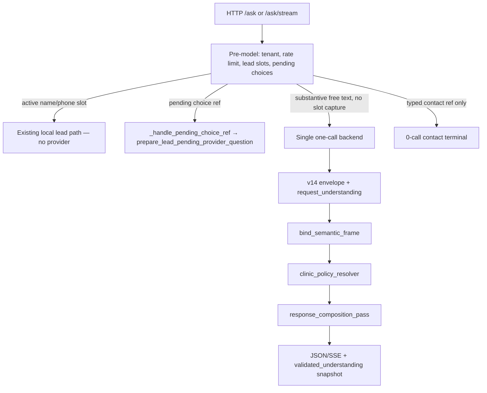

# D1R — model understanding + code-owned clinic rules (integration design)

Checkpoint **A1** (design correction). Prior checkpoint **A:** `5a28fb0`. Baseline `70696ca80d9a1c9f3a15a3472cccb800215a06bf`. Branch `codex/demo-d1-clinic-policy`. Implementation `aaf9eaa` (regex D1) remains as evidence until checkpoint **B** replaces it.

Architect decision (fixed): one model call; `request_understanding` in envelope; code applies clinic policies and owns policy/price/contact/booking blocks. No second LLM, no regex/substring classifiers for services, patient, clinic rules, or mixed business requests.

---

## 1. Typed contract: `request_understanding`

Two new top-level envelope fields at checkpoint B: `request_understanding` and `primary_price_request_id`. Provenance: model JSON → validated → copied into `SalesOnePlusSemanticFrame` by `bind_semantic_frame` (and any `from_envelope_only` / result adapters updated in B). Never re-parsed from `patient_text` or raw user message.

### 1.1 Pydantic types (final for B)

New module `contracts/request_understanding.py` (recommended).

```python
SubjectRelation = Literal["self", "other", "unknown"]
AgeGroup = Literal["adult", "child", "unknown"]
RequestKind = Literal["clinic_policy", "booking", "price", "contact", "content", "other"]
RequestContext = Literal["current_care", "general_information", "past_history", "unknown"]
PaymentScheme = Literal["oms", "dms", "self_pay", "unspecified"]
PaymentSchemeIntent = Literal[
    "eligibility_question", "requested_payment", "not_requested", "unspecified"
]
```

**`RequestUnderstandingSubject`**

| Field | Type | Invariants |
|---|---|---|
| `subject_id` | `str` | Non-blank, unique within turn; pattern `s[1-9][0-9]*` |
| `relation` | `SubjectRelation` | `unknown` allowed; no forced `self` |
| `age_group` | `AgeGroup` | No numeric age; `unknown` ≠ denial; past_history alone must not imply `child` |

**`RequestUnderstandingRequest`**

| Field | Type | When required / notes |
|---|---|---|
| `request_id` | `str` | Unique within turn; pattern `r[1-9][0-9]*`; order preserved |
| `kind` | `RequestKind` | Resolver routing |
| `subject_id` | `str \| None` | **Optional** for `clinic_policy`, `contact`, `content`, general `price` (no named patient). Required only when a request explicitly names a patient subject. For `booking`, `null` = patient identity not yet determined (valid JSON, not schema error) |
| `context` | `RequestContext` | See age_group rules above |
| `policy_ids` | `tuple[str, ...]` | `clinic_policy` only; may be empty — code may still apply rules from subject facts |
| `payment_scheme` / `payment_scheme_intent` | | OMS mention alone ≠ `requested_payment` |
| `contact_fields` | `tuple[str, ...]` | `contact` only; existing aspect ids |
| `content_text` | `str \| None` | `content` / `other` only; see §3.2 size limits |

**No `primary_service_id` on requests** — service identity stays in existing envelope authority (`service_id`, `requested_service_id`, precomposer).

**`RequestUnderstanding`**

| Field | Type | Invariants |
|---|---|---|
| `subjects` | `tuple[..., ...]` | **May be empty** when no patient is implied («Ваш адрес?», «Работаете по ОМС?», general FAQ) |
| `requests` | `tuple[..., ...]` | ≥1 for ANSWER/CLARIFY with substantive understanding; every non-null `subject_id` must resolve |

**Envelope-level link (not a second service definition)**

| Field | Type | Invariants |
|---|---|---|
| `primary_price_request_id` | `str \| None` | Points to one `kind=price` request id that drives **existing** primary price/commerce authority for this turn. Null when no price block is rendered via that path. Does not duplicate `service_id` semantics |

**`OneCallEnvelope.request_understanding`** — required on production ANSWER/CLARIFY after v14 (see §3 for ADMIN/invalid).

**`SalesOnePlusSemanticFrame.request_understanding`** — copy from envelope in `bind_semantic_frame`; update `from_envelope_only` and any frame constructors used in tests/runtime.

No confidence field.

### 1.2 Example envelope JSON (mixed OMS + adult tomography price)

User: «По ОМС работаете? Если нет, сколько стоит КТ взрослому?»

Demo catalog service id: **`tomography`** (not `ct`).

```json
{
  "route": "ANSWER",
  "service_id": "tomography",
  "extent": null,
  "jaw": null,
  "stage": null,
  "scenario": "none",
  "commercial_intent": "price",
  "promotion_scope": "none",
  "clarify_axis": null,
  "clarify_service_options": null,
  "patient_text": null,
  "price_text": null,
  "service_reference_status": "resolved",
  "requested_service_id": "tomography",
  "references": { "direct_fact_ids": [] },
  "primary_price_request_id": "r2",
  "request_understanding": {
    "subjects": [
      { "subject_id": "s1", "relation": "unknown", "age_group": "adult" }
    ],
    "requests": [
      {
        "request_id": "r1",
        "kind": "clinic_policy",
        "subject_id": null,
        "context": "general_information",
        "policy_ids": ["no_oms"],
        "payment_scheme": "oms",
        "payment_scheme_intent": "eligibility_question",
        "contact_fields": [],
        "content_text": null
      },
      {
        "request_id": "r2",
        "kind": "price",
        "subject_id": "s1",
        "context": "current_care",
        "policy_ids": [],
        "payment_scheme": "unspecified",
        "payment_scheme_intent": "not_requested",
        "contact_fields": [],
        "content_text": null
      }
    ]
  }
}
```

**Patient-free policy/contact examples (sketch):**

- «Работаете по ОМС?» — `subjects: []`, one `clinic_policy` request, `subject_id: null`.
- «Ваш адрес?» — `subjects: []`, one `contact` request with `contact_fields: ["contact_address"]`.

### 1.3 Multi-price behavior (D1R, not D2 basket)

- If runtime already supports only **one** primary price surface per turn, set `primary_price_request_id` to the best-supported price request; other price requests → ledger `unsupported` or `clarification_needed` **per request**, not global `route=CLARIFY` that drops policy/contact answers.
- Do **not** assign one `service_id` to answer unrelated price requests.
- Do **not** implement multi-service price basket in D1R; D2 remains owner of full service/scope alignment.

---

## 2. End-to-end call flow



**Remove in B:** free-text `_try_deterministic_clinic_policy_terminal` and regex business authority in `core/one_call_clinic_policy_authority.py` (replace file body with pure resolver adapter — see §7).

**New booking intent (free text):** one-call → policy resolver → if allowed, enter lead via existing flow; typed booking actions reuse session snapshot + UI freshness guards.

**Contacts:** free-text address → one-call; typed UI contact → existing 0-call terminal only.

---

### 2.1 Mandatory interpretation scenarios

| User input (paraphrase) | Neutral understanding |
|---|---|
| Я взрослый, но хочу записать ребёнка | subject `s1` child/other; `booking` → `s1`; speaker adult does not cancel child patient |
| В детстве лечили зуб, теперь нужна коронка | `past_history`; no current child age |
| По ОМС работаете? Если нет, сколько стоит КТ взрослому? | policy OMS + price `r2` + `primary_price_request_id=r2`, `service_id=tomography` |
| ОМС мне не нужен, сколько стоит КТ? | OMS `not_requested`; price only |
| Принимаете детей и где находитесь? | pediatric policy + contact address |
| Сколько стоит лечение ребёнка? | price + child subject; resolver blocks as offer/booking, not hidden CLARIFY |
| Ваш адрес? / Работаете по ОМС? | `subjects: []`; contact or policy request with `subject_id: null` |
| Что такое имплантация? | `content` request; prose in `content_text` for that request only |

---

## 3. v14 route, text, and validation (production path)

Changes required in **`contracts/one_call_envelope.py`**, **`core/one_call_envelope_protocol.py`**, **`core/one_call_prompt_contract.py`**, and **`tests/test_sales_one_plus_turn.answer_envelope`** / **`dumps_production_envelope`** helpers — not example-only.

| Route | v14 rules |
|---|---|
| **ANSWER** | `patient_text` **nullable** when materialization uses request ledger. Code-owned policy/price/contact/booking blocks ignore hostile legacy `patient_text` in fixtures. Content prose only in per-request `content_text`; **do not** duplicate into global `patient_text`. Content-only turns still produce visible answer from content ledger + existing content path. |
| **CLARIFY** | May carry partial `request_understanding`; ledger marks `clarification_needed` on specific requests while other requests may still `answered` under ANSWER composition rules. Do not use `clarify_axis=service` to disambiguate unnamed patients — use request-level clarification. Full-route CLARIFY: document question source (which `request_id` or global handoff text). |
| **ADMIN** | Terminal; `patient_text` null; `request_understanding` may be **empty** (`subjects: []`, `requests: []`) if safe terminal already defined. |
| **Invalid envelope** | Fail closed; no implied permission to treat or book. |

**Size limits**

- Keep `MAX_ENVELOPE_UTF8_BYTES = 64 KiB` for full envelope.
- Sum of all `content_text` strings in a turn: **≤ 4000 Unicode code points** (validation cap, not target answer length).
- Do not duplicate the same prose in `patient_text` and `content_text`.
- Do not raise output token budget or add provider calls automatically; document existing model output limits and truncation behavior in B if composition approaches cap.

**`core/one_call_closed_envelope_validation.py`:** capability-probe / sample JSON for evals only — **out of B scope** unless a callsite audit proves production dependency (current grep: stage3a/3b offline tests + eval probes only).

---

## 4. Policy resolver and composition (unchanged intent)

Pure **`clinic_policy_resolver`**: validated understanding + validated pack policies → per-`request_id` decision (`allowed_by_known_rules | blocked | needs_clarification | no_applicable_rule | unsupported`).

Composition ledger drives final text/UI/session; no regex contradiction filter on model prose for code-owned blocks.

---

## 5. Lead, privacy, and existing local mechanism (preserve)

**Do not replace** the connected chain. No new UX; no mandatory “repeat your question” unless existing privacy fallback already does.

| Step | Code (existing) |
|---|---|
| Name slot | `core/lead_name_slot.py` — pymorphy3 via `alias_lexical.morph_analyzer`, local name checks |
| Unrecognized PII slot input | `core/lead_turn_classifier.py` → `pending_interrupt` |
| Pending choice UI | `flow_handlers.py` — `_pending_name_choice_payload`, `_pending_phone_choice_payload` |
| User chooses “answer question” | `_handle_pending_choice_ref` → `prepare_lead_pending_provider_question` (`core/lead_provider_input_privacy.py`) → `bind_lead_provider_question` |
| No safe question extractable | Existing privacy fallback asks to rephrase |
| Safe extract | Stored pending provider question; **one** model call after cleanup without re-capture by early business terminal |

`provider_message_has_substance` remains part of this privacy chain — **not** a standalone semantic classifier for D1R business routing.

**D1R boundary additions only**

- New free-text **booking intent** → one-call → policy → then existing lead entry if allowed.
- Typed booking actions: use **`validated_understanding` snapshot** + existing UI freshness/session guards.
- Active name/phone slots and pending choices: unchanged local servicing (`tests/test_tenant_lead_pending_question_offline.py` must keep passing behavior).

Local phone/name format checks and pymorphy3 stay. Do not expand word lists for clinic/service/policy understanding.

**Still undefined for B (name if integration conflict appears):** exact hook point when one-call must preempt an open lead slot without breaking pending choice refs.

---

## 6. Session snapshot: `validated_understanding`

Name **`validated_understanding`**: code validated structure and applied rules — not proof of model semantic correctness.

**Minimal snapshot (single object, versioned)**

| Field | Purpose |
|---|---|
| `schema_version` | e.g. `1` |
| `source_turn` | Monotonic turn counter at write |
| `client_id` / session binding | Tenant isolation |
| `subjects` | Local `subject_id`, `relation`, `age_group` (no PII) |
| `requests` | `request_id`, `kind`, `subject_id` ref |
| `decisions` | Applied policy/booking decisions: `request_id`, `policy_key`, outcome, **`subject_id`** |
| `active_booking_request_id` | Nullable; links lead/booking CTAs |
| `permissions` | Action allow/deny keyed by **`(source_turn, request_id)`**, not bare `r1` |

**Producer:** composition pass after resolver (writer in **`core/target_runtime_session.py`** on `TargetRuntimeSessionState`).

**Reader:** lead transitions, typed booking actions, UI materialization — **after** existing UI freshness / session guards; never trust client-sent allow/blocked.

**Invalidation:** session reset; client/tenant mismatch; stale UI ref (existing guards); new turn supersedes `source_turn`; conflicting subject facts for same `subject_id`; new topic — not only “conflicting message”. Stale button → safe clarification, not stale permission.

**Non-goals:** do not globalize one child block to later adult self request; do not wipe unrelated concurrent valid requests.

---

## 7. Checkpoint B — file allowlist (A1 refined)

### 7.1 Production / contracts (create or modify)

| Path | Change |
|---|---|
| `contracts/request_understanding.py` | **New** types |
| `contracts/clinic_policy_resolution.py` | **New** resolver result types |
| `contracts/one_call_envelope.py` | `request_understanding`, `primary_price_request_id`; v14 validators |
| `contracts/sales_one_plus_semantic.py` | Carry understanding; update **`from_envelope_only`** |
| `core/one_call_envelope_protocol.py` | Parse/normalize v14 ANSWER nullable `patient_text` |
| `core/one_call_prompt_contract.py` | v14 instructions |
| `core/sales_one_plus_protocol.py` | System policy wording |
| `core/one_call_fullcontext_messages.py` | Keep authored policies block |
| `core/sales_one_plus_semantic_authority.py` | Bind understanding in **`bind_semantic_frame`** |
| `core/clinic_policies_loader.py` | Strict validate at D1R boundary |
| `core/one_call_clinic_policy_authority.py` | **Replace** regex/heuristic body with pure resolver + thin adapter (or delegate to `clinic_policy_resolver.py`); no second rule source |
| `core/clinic_policy_resolver.py` | **New** pure resolver |
| `core/one_call_response_composition.py` | **New** mixed ledger assembly |
| `core/one_call_presentation_pass.py` | Composition integration; remove D1 regex hook |
| `core/sales_fast_widget_runtime.py` | Wire resolver → composition |
| `core/target_runtime_session.py` | **`validated_understanding`** read/write/invalidation |
| `orchestration/sales_one_plus_ask_turn.py` | Remove D1 free-text policy terminal; lead/one-call ordering |
| `flow_handlers.py` | Only if proven integration gap (document in PR) |
| `core/sales_one_plus_turn.py` | Update **`_model_result_from_envelope`** / adapters if understanding affects result surface |

**Explicitly out of B unless audit proves need:** `core/one_call_closed_envelope_validation.py` (probe/eval only today).

### 7.2 Tests and fixtures (exact paths)

| Path | Change |
|---|---|
| `tests/test_sales_one_plus_turn.py` | `answer_envelope` / helpers — default v14 `request_understanding` |
| `tests/test_one_call_stage4_2_closed_envelope_production.py` | Constructors — v14 ANSWER nullable text rules |
| `tests/test_one_call_envelope_v5_direct_facts.py` | Envelope builders |
| `tests/test_one_call_envelope_v4_service_reference.py` | Envelope builders |
| `tests/test_sales_one_plus_stream.py` | `OneCallEnvelope(...)` direct builds |
| `tests/test_demo_clinic_policy_authority_offline.py` | **Replace** with D1R HTTP suites or delete after port |
| `tests/test_request_understanding_schema_offline.py` | **New** |
| `tests/test_clinic_policy_resolver_offline.py` | **New** |
| `tests/test_demo_d1r_http_offline.py` | **New** JSON/SSE |
| `tests/test_demo_d1r_route_budget_offline.py` | **New** routing |
| `tests/fixtures/d1r_envelope_mixed_oms_tomography.json` | **New** neutral fixture (§1.2) |
| `tests/fixtures/d1r_envelope_hostile_patient_text.json` | **New** hostile `patient_text` + correct understanding |
| `tests/fixtures/d1r_envelope_no_subjects_contact.json` | **New** address-only |
| `tests/fixtures/one_call_stage2_cases.json` | Update only if stage2 harness still used with v14 defaults |
| `tests/test_tenant_lead_pending_question_offline.py` | **Keep behavior** — regression guard for §5 |
| `tests/test_clinic_policies_loader.py` | Keep + loader strict tests |
| `tests/test_demo_implant_volume_scope_offline.py` | Keep in CI regression |
| `tests/test_one_call_stage4_3_contacts_specific.py` | Keep |
| `tests/test_one_call_tenant_isolation_offline.py` | Keep |
| `.github/workflows/ci.yml` | Rename job to D1R suites; retain useful regressions above |

### 7.3 Existing test migration notes (contract → expectation)

| Test area | Contract change | Preserved behavior |
|---|---|---|
| `answer_envelope(...)` callers | Default includes minimal valid `request_understanding`; ANSWER may use `patient_text=null` when ledger owns output | HTTP still 200; fake backend still once per free-text turn |
| Stage4.2 envelope unit tests | v14 nullable ANSWER text when understanding present | Route invariants, commercial fields |
| D1 policy HTTP tests | Replaced by D1R fixtures supplying understanding, not regex terminal | Same user-visible policy facts from YAML |
| Tenant lead pending | None if lead chain untouched | Pending choice → sanitized question → one model call |

---

## 8. Test matrix (offline)

Layers 1–4 unchanged in intent; layer 5 model paraphrase matrix file-only until D5. Layer 3 must include no-subject contact/policy cases and partial multi-request ledger.

---

## 9. Remaining undefined (honest)

1. Exact B hook if one-call and open lead slot conflict (§5).
2. Full-route CLARIFY copy source when multiple requests partially answered.
3. Truncation behavior when composition nears model output limits (audit in B, no budget change by default).
4. Whether `flow_handlers.py` needs a one-line ordering change beyond documented lead chain.

**Closed from architect A1 review:** content_text 4000 cap; lead copy reuses existing UI; multi-price uses per-request ledger not global CLARIFY-only; CI job rename in B.

---

## 10. Checkpoint evidence

| Checkpoint | Scope | Production code |
|---|---|---|
| A | Initial design | Unchanged |
| **A1** | Architect review corrections (§1–7, §5 lead chain) | **Unchanged** |
| **B** | D1R implementation (checkpoint fde818c+) | `request_understanding`, resolver, composition, v14 envelope |

Provider calls: **0** for A/A1 documentation work.

Checker: focused recheck on A1 six points (see commit message / PR).


## B focused correction: price composition and free-text contacts

Baseline: `e524f0e51745cac539232479334e5429e03c4d83`; same branch/worktree.
This checkpoint covers two bounded stages, not acceptance of all D1R B.

- A price-only ANSWER can reach code-owned materialization without invented model prose.
- The final price composer preserves authored policy, structured contact, and content slots.
  Model patient_text is not a source of the primary price block.
- A blocked primary price stops before commerce/marketing/UI rendering; its other requests
  remain visible. Neither the selected offer nor a previous patient's offer is retained as
  the current selection for this denied price turn.
- Free-text contacts go through the single model call, including ordinary mixed questions.
  Tenant-specific phone rendering remains code-owned; its existing isolation test now supplies
  explicit contact understanding and expects one call per turn.

New regression suite: `tests/test_demo_d1r_composition_offline.py`, JSON and SSE.
Offline only, isolated temporary sessions/logs, real provider transport blocked by the runner.
No merge, deploy, D2, or live-model validation is included.

Still open from B review: requested OMS/DMS payment semantics and malformed policy data (R4),
freshness/authorization of all booking entry paths (R5), strict production v14 validation and
complete model-facing schema (R6). Multi-price ledger completion and broader clarification /
failure composition are not declared complete by these bounded fixes. B is not ready to merge.


Verification: the 11-file `demo-d1-clinic-policy-regression` set (the existing ten files
plus the new suite) passed **118/118** offline: 102 existing and 16 new cases. Initial
regressions were reproduced on the original implementation; the phone test was migrated
from the deliberately removed 0-call route without relaxing tenant isolation assertions.
Provider calls: **0**. Independent checkpoint review is recorded in the completion report.

Additional result/stream contract suites: `test_sales_one_plus_turn.py` and
`test_sales_one_plus_stream.py`, **41/41 passed** (159 total root checks).
Independent read-only Checker: **PASS for these two stages only**, independently
re-ran the new suite **16/16 passed**; no blocking checkpoint findings. No new failures
in the executed suites. Previously reported caplog failures outside this set were not rerun.

## B completion correction: R4–R6 and partial composition

Correction baseline: `38031522ebc4652038cd7771b0361f82cde84520`;
main/merge baseline remains `70696ca80d9a1c9f3a15a3472cccb800215a06bf`.
Same worktree and `codex/demo-d1-clinic-policy` branch.

- R4: structured payment, age, and context facts drive per-request authored policy
  decisions. Requested OMS/DMS blocks only the affected request; an independent
  self-pay request remains eligible. Unknown payment conditions require confirmation,
  without an invented prohibition or a rendered offer. Raw policy YAML is validated
  before the legacy loader can discard malformed rows.
- R5: a new semantic turn invalidates prior booking permission. Post-model entry
  requires the current successful snapshot, tenant, request, and permission. Typed
  booking uses the current server-emitted action; substantive text accompanying an
  old action goes through understanding. Pending-offer free-text acceptance also
  goes through the single model call. Existing active name/phone and privacy paths
  remain local. UI-only eligibility does not auto-start booking.
- R6: every production ANSWER/CLARIFY requires nonempty understanding, including raw
  null/empty/missing-field cases. ADMIN remains a safe terminal. Model instructions
  expose enums, subject/request identifiers, references, and per-request text rules.
- One canonical primary price is rendered; additional price requests receive an
  explicit clarification, without a D2 basket. Partial price clarification preserves
  policy/contact/content answers. The validated envelope's `patient_text` supplies
  a full-route CLARIFY question; a code-generated scope defer uses its existing
  question. The stored ledger records final composition outcomes rather than
  marking price answered before rendering.

The presentation contract additionally carries `composition_resolution` in
`contracts/one_call_presentation_result.py`; this allowlist extension is necessary
to pass final per-request outcomes into session state. Existing v4/v5 test files
from §7.2 were migrated to the actual v14 field count and constructor requirements.
The hostile-policy fixture now really supplies hostile model text, and the
content-plus-policy regression contains both requests.

Output budget remains **1024 completion tokens** in both live backend methods;
the envelope limit remains **64 KiB**, aggregate content text **4000 code points**.
These are ceilings, not a promise that 4000 characters fit in the provider budget.
Streaming buffers the complete JSON before validation. Truncated/malformed JSON
fails closed with no retry or second provider call; semantic correctness of an
otherwise valid model output still requires the separately authorized model eval.

Verification is offline with fake backends, isolated temporary tenant databases
and logs, and real transport blocked: **315 passed** in the 16-file set below.
The completion report records the reviewed SHA and independent Checker verdict. Full repository CI is
still required before any owner-authorized merge; this correction performs no
merge, deploy, live-model validation, or worktree removal.

Baseline comparison of the v4/v5 suites on an exported clean `3803152` snapshot:
48 passed, four pre-existing failures (old field-count/version expectations and
the oversized-envelope helper hitting the content-text cap before parser entry).
The current fixtures exercise the intended v14/parser boundary. Previously noted
caplog failures outside the executed suites were not rerun.

Exact final suite selection (run with the isolated offline runner, which invokes
pytest with `-q -p no:cacheprovider --basetemp <fresh-temp> --tb=short`):

```text
tests/test_request_understanding_schema_offline.py
tests/test_clinic_policy_resolver_offline.py
tests/test_demo_d1r_http_offline.py
tests/test_demo_d1r_composition_offline.py
tests/test_demo_d1r_route_budget_offline.py
tests/test_demo_clinic_policy_authority_offline.py
tests/test_tenant_lead_pending_question_offline.py
tests/test_clinic_policies_loader.py
tests/test_demo_implant_volume_scope_offline.py
tests/test_one_call_stage4_3_contacts_specific.py
tests/test_one_call_tenant_isolation_offline.py
tests/test_sales_one_plus_turn.py
tests/test_sales_one_plus_stream.py
tests/test_one_call_stage4_2_closed_envelope_production.py
tests/test_one_call_envelope_v4_service_reference.py
tests/test_one_call_envelope_v5_direct_facts.py
```

### Focused Checker correction: situation intake

The independent Checker reviewed `1a68796` and found one remaining R5 bypass:
after a child-booking denial, `situation_action=start` followed by a situation note
could enter name collection without another policy decision. The follow-up gates
the start on a current server-emitted situation permission. Submitting a substantive
note now uses the existing pending-question privacy preparation and the single
model/policy path; it cannot directly grant booking. Name/phone-only notes stay
local, and raw situation notes remain in their existing local storage.
Only this finding and affected situation/lead/privacy transitions are rechecked;
the preceding review found no other blocking R4/R6/composition issue.
Follow-up verification: **79 passed** across `test_demo_d1r_http_offline.py`,
`test_situation_intake_http_offline.py`, and `test_tenant_lead_pending_question_offline.py`
using the same isolated offline runner; real provider calls and transport attempts
both zero. The positive situation test joins the real authored-content renderer
and snapshot builder with the HTTP intake path, alongside denied/stale/forged and
PII-only/mixed-note cases.
